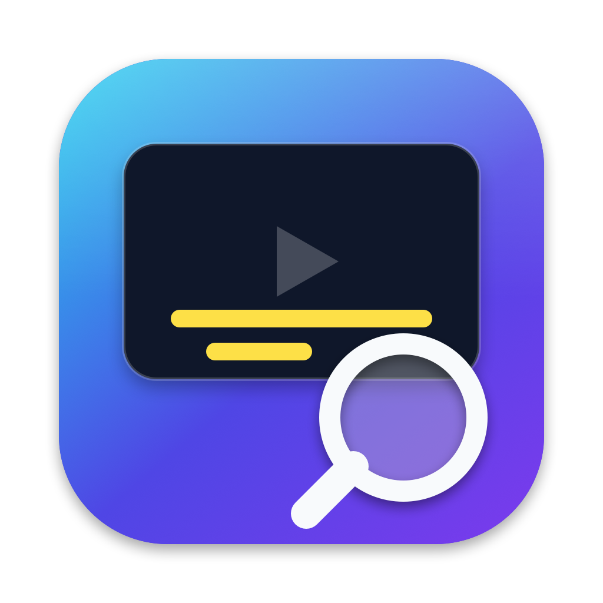

<p align="center"></p>

# Subtitle Find

App de escritorio para macOS. Arrastras vídeos, varios ficheros o carpetas y busca **subtítulos en castellano**, normales y forzados, en fuentes públicas. Los descarga y los guarda junto a cada vídeo.

## Qué hace

- Acepta ficheros sueltos, selecciones múltiples y carpetas (se recorren enteras, con subcarpetas). También puedes soltarlos sobre el icono del Dock.
- Formatos de vídeo reconocidos: `mkv mp4 m4v avi mov wmv mpg mpeg ts m2ts webm flv divx`.
- Para cada vídeo hace **dos búsquedas independientes**: subtítulo normal y subtítulo forzado (solo partes en otro idioma).
- Guarda los resultados con el nombre del vídeo:

| Tipo | Fichero resultante |
|---|---|
| Forzado | `Película.srt` (mismo nombre que el vídeo) |
| Normal | `Película_es.srt` |

- Si el `.srt` ya existe, lo salta (se puede cambiar en Ajustes).
- Convierte todo a UTF-8, así que los acentos se ven bien aunque el original venga en Windows-1252 o Latin-1.

## Requisitos

- macOS 14 (Sonoma) o superior.
- Para compilar: Xcode / Swift 5.9 o superior.
- Una API key gratuita de [OpenSubtitles.com](https://www.opensubtitles.com/consumers). Opcionalmente, otra de [SubDL](https://subdl.com/panel/api) como respaldo.

## Compilar e instalar

```bash
./build.sh
```

Genera `build/SubtitleFind.app` (firma ad-hoc). Para compilar e instalar en `/Applications` de una vez (cierra la app si está abierta y la vuelve a abrir):

```bash
./install.sh
```

También puedes mover `build/SubtitleFind.app` a `/Aplicaciones` a mano. La primera vez, macOS puede avisar de que no es de un desarrollador identificado: haz clic derecho sobre la app → **Abrir**.

Para regenerar el icono: `swift tools/make_icon.swift`.

## Idiomas

La interfaz está en **español** e **inglés** y sigue el idioma del sistema. Las traducciones están en `Resources/es.lproj` y `Resources/en.lproj` (`Localizable.strings`); para añadir otro idioma, crea su carpeta `.lproj`, añádelo a `CFBundleLocalizations` en `Info.plist` y a `build.sh`.

## Primeros pasos

1. Abre la app y ve a **Ajustes** (⌘,).
2. Pega tu API key de OpenSubtitles. Si añades usuario y contraseña de tu cuenta, la cuota diaria de descargas es mayor.
3. Arrastra vídeos o carpetas a la ventana. Cada fila muestra el estado del subtítulo normal y del forzado.

## Cómo busca

Para cada vídeo, los proveedores se prueban por orden (OpenSubtitles y después SubDL). Dentro de cada uno:

1. **Hash del fichero** (solo OpenSubtitles): identifica la versión exacta del vídeo. Es el resultado más fiable.
2. **Id de IMDB**, que se obtiene así:
   1. el que hayas fijado a mano con clic derecho → *Fijar id de IMDB…* (para series, el id de la **serie**);
   2. un `tt1234567` en el nombre de carpeta o fichero, o en un `.nfo` junto al vídeo (en series, solo en `tvshow.nfo`);
   3. la resolución automática del título en IMDB, que entiende títulos en castellano ("Fundación" → `tt0804484`).
3. **Título** (y año, temporada y episodio extraídos del nombre del fichero), solo si lo anterior no ha dado resultados.

De los candidatos elige el mejor por: coincidencia de hash, parecido del nombre de la versión con el del fichero, número de descargas y si es de usuario de confianza. Penaliza los pensados para sordos en el subtítulo normal. Si la descarga del primero falla, prueba con los dos siguientes.

Cada fila indica qué id de IMDB se usó. Si resolvió la película equivocada, corrígelo con clic derecho → *Fijar id de IMDB…*.

## Fuentes

| Fuente | Uso | Notas |
|---|---|---|
| [OpenSubtitles.com](https://www.opensubtitles.com) | Búsqueda y descarga | Marca los forzados de forma fiable. Cuota diaria de descargas. |
| [SubDL](https://subdl.com) | Búsqueda y descarga (respaldo) | No marca los forzados: se deducen si el nombre contiene "forced" o "forzado". |
| IMDB (endpoint de sugerencias) | Solo traducir título → id | No oficial, sin clave. Puede cambiar sin aviso. |

## Privacidad

La app solo envía a OpenSubtitles, SubDL e IMDB el título, el año, la temporada/episodio, el id de IMDB y el hash del vídeo. **No sube nunca el vídeo.** Las API keys y la contraseña de OpenSubtitles se guardan en las preferencias de la app (`UserDefaults`), sin cifrar.

## Limitaciones

- Solo castellano (`es` de OpenSubtitles); no busca español latino.
- La cuota de descargas de OpenSubtitles es limitada. Si se agota, el error aparece en la fila del vídeo; pulsa *Reintentar fallidos* más tarde.
- La detección de forzados con SubDL es una heurística por nombre.
- No hay descarga de subtítulos en otros idiomas ni conversión de formatos (solo `.srt`).

## Solución de problemas

| Síntoma | Qué probar |
|---|---|
| "no encontrado" | Fija el id de IMDB a mano (clic derecho). Comprueba que el nombre del fichero incluye título y, en series, `S01E02`. |
| Encuentra el subtítulo de otra película | Mira la línea "IMDB:" de la fila y corrige el id. |
| "error" | Pasa el ratón sobre el estado para ver el mensaje. Suele ser API key inválida o cuota agotada. |
| Un `.srt` no se sobrescribe | Activa *Sobrescribir subtítulos existentes* en Ajustes. |

## Autor

Miguel Gonzalez Oreiro

- Correo: [mgoreiro@gmail.com](mailto:mgoreiro@gmail.com)
- GitHub: [github.com/mgoreiro](https://github.com/mgoreiro)

Los datos que muestra *Acerca de* están en [Author.swift](Sources/SubtitleFind/Author.swift).

## Licencia

[MIT](LICENSE) © 2026 Miguel Gonzalez Oreiro. Puedes usar, modificar y distribuir la app libremente conservando el aviso de copyright. Se ofrece sin garantía.

La app solo usa las APIs públicas de OpenSubtitles, SubDL e IMDB; respeta sus condiciones de uso. Los subtítulos descargados pertenecen a sus autores.

Más detalle técnico en [docs/arquitectura.md](docs/arquitectura.md).
